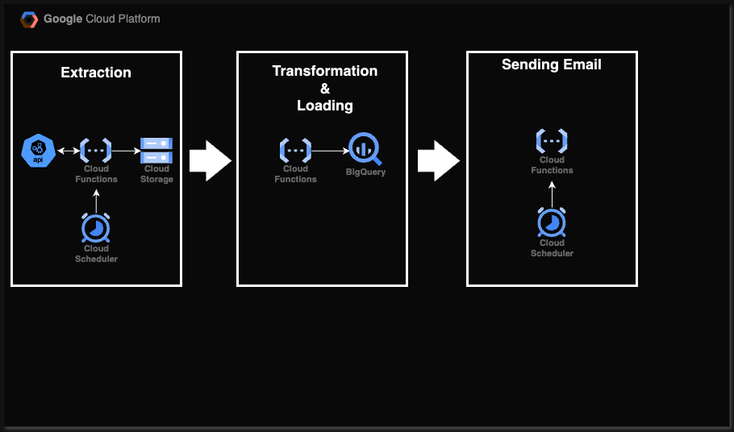

# Agriculture Market Data Pipeline

This project automates the collection, storage, and reporting of EU agricultural market data. Leveraging Google Cloud Platform (GCP) services, it fetches data monthly from the [EU Agriculture Data Portal](https://agridata.ec.europa.eu/extensions/DataPortal/agricultural_markets.html), loads it into BigQuery, and sends a summary email report using the Gmail API.

---

## Table of Contents
1. [Overview](#overview)
2. [Architecture](#architecture)
3. [Pipeline Components](#pipeline-components)
4. [Cloud Functions](#cloud-functions)
5. [Cloud Schedulers](#cloud-schedulers)
6. [BigQuery Schema](#bigquery-schema)

---

## Overview

This pipeline is designed to:
- Fetch data each month from the [EU Agriculture Data Portal](https://agridata.ec.europa.eu/extensions/DataPortal/agricultural_markets.html).
- Store the data in a Google Cloud Storage bucket.
- Transform and load the data into BigQuery for analysis.
- Send a monthly email report using the Gmail API.

---

## Architecture

### Components
1. **Google Cloud Storage (GCS)** - Stores raw JSON data files.
2. **BigQuery (BQ)** - Stores transformed and deduplicated data.
3. **Cloud Functions (CF)** - Automates data extraction, transformation, loading, and email reporting.
4. **Cloud Scheduler** - Triggers Cloud Functions on the 2nd day of each month.

---

## Pipeline Components

### 1. **Google Cloud Storage Bucket**
   - **Bucket Name:** `agridata_project_data`
   - **Purpose:** To temporarily store JSON data files fetched from the EU Data Portal.

### 2. **BigQuery Dataset and Table**
   - **Dataset:** `agriculture_production`
   - **Table:** `tbl_production`
   - **Schema:**
     - `country`: STRING
     - `year_month`: DATE
     - `tonnes`: FLOAT
     - `category`: STRING

### 3. **Cloud Functions**

- **Extract Function**
   - **Trigger**: HTTP request from Cloud Scheduler.
   - **Frequency**: `0 0 2 * *`.
   - **Description**: Fetches data from the EU Agriculture Data Portal and saves it to `agridata_project_data`.

- **Transform and Load Function**
   - **Trigger**: Fires whenever a new file is added to GCS.
   - **Description**: Transforms JSON data, performs deduplication, and loads new entries into BigQuery.

- **Email Reporting Function**
   - **Trigger**: HTTP request from Cloud Scheduler on the 2nd day of each month, an hour after data load completes.
   - **Description**: Queries BigQuery for the latest data and sends an HTML email report via the Gmail API.

### 4. **Cloud Scheduler Jobs**

- **Data Extraction Scheduler**
   - **Name**: `schedule_agridata_api`
   - **Frequency**: `0 0 2 * *`
   - **Target**: HTTP request to `extract_function` endpoint.

- **Email Report Scheduler**
   - **Name**: `schedule_email_report`
   - **Frequency**: `0 1 2 * *` (1 hour after extraction).
   - **Target**: HTTP request to `email_report_function` endpoint.

---

## BigQuery Schema

| Field       | Type   | Description                        |
|-------------|--------|------------------------------------|
| country     | STRING | Country name                      |
| year_month  | DATE   | Year and month of production data |
| tonnes      | FLOAT  | Production in 1000 tonnes         |
| category    | STRING | Category (e.g., Bull, Bullock)    |
